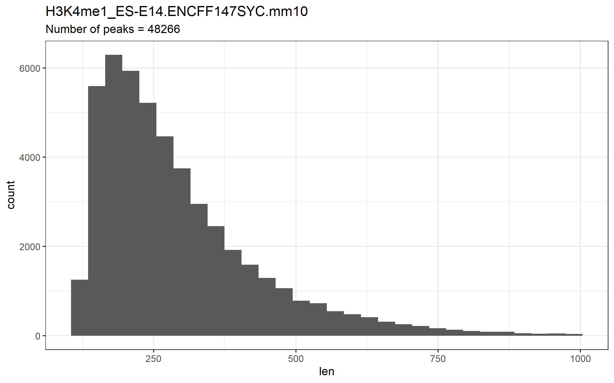
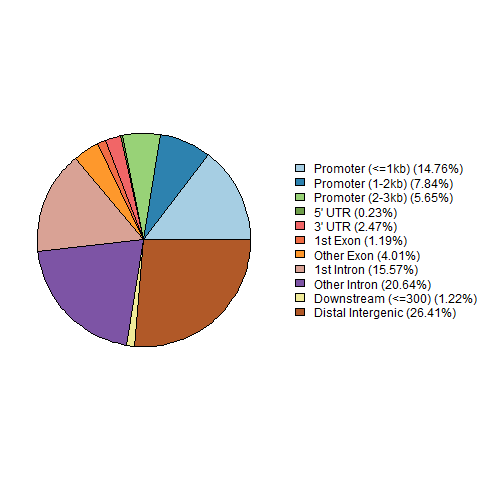
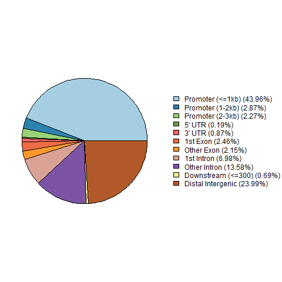
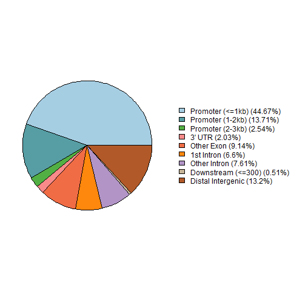

# [Проект по майнору "Биоинформатика" ВШЭ](http://wiki.cs.hse.ru/%D0%9C%D0%B0%D0%B9%D0%BD%D0%BE%D1%80_%D0%91%D0%B8%D0%BE%D0%B8%D0%BD%D1%84%D0%BE%D1%80%D0%BC%D0%B0%D1%82%D0%B8%D0%BA%D0%B0_2_%D0%B3%D0%BE%D0%B4)
## Сафин Тагир Наилевич, 2 группа


|   Организм  |   Стр. ДНК   | Тип клеток | Гистоновая метка |    файл 1   |    файл 2   |
|:-----------:|:------------:|:----------:|:----------------:|:-----------:|:-----------:|
| mouse(mm10) | ZDNA_mouse_1 |   ES-E14   |      H3K4me1     | [ENCFF158GBZ](https://www.encodeproject.org/files/ENCFF158GBZ/) | [ENCFF147SYC](https://www.encodeproject.org/files/ENCFF147SYC/) |

### Анализ пиков гистоновой метки

**Скачиваем файлы ChIP-seq экспериментов из ENCODE (пики гистоновой метки).**

- ENCFF158GBZ
```bash
wget https://www.encodeproject.org/files/ENCFF158GBZ/@@download/ENCFF158GBZ.bed.gz
zcat ENCFF158GBZ.bed.gz | cut -f1-5 > H3K4me1_ES-E14.ENCFF158GBZ.mm10.bed
```
- ENCFF147SYC
```bash
wget https://www.encodeproject.org/files/ENCFF147SYC/@@download/ENCFF147SYC.bed.gz
zcat ENCFF147SYC.bed.gz | cut -f1-5 > H3K4me1_ES-E14.ENCFF147SYC.mm10.bed
```

**Строим гистограмму длин участков для каждого эксперимента.**

 ENCFF147SYC             |   ENCFF158GBZ
:-------------------------:|:-------------------------:
  |  

**Среди ChIP-seq пиков для нужной версии генома (hg19 для человека и mm10 для мыши) выкидываем слишком длинные пики (>= 1000).**

init ENCFF147SYC             |  fitered ENCFF147SYC
:-------------------------:|:-------------------------:
  |  

init ENCFF147SYC             |  fitered ENCFF147SYC
:-------------------------:|:-------------------------:
  |  

**Смотрим, где располагаются пики гистоновой метки относительно аннотированных генов.**

 ENCFF147SYC             |   ENCFF158GBZ
:-------------------------:|:-------------------------:
  |  

**Объединяем два набора отфильтрованных ChIP-seq пиков с помощью утилиты bedtools merge.**
```bash
cat *.filtered.bed | sort -k1,1 -k2,2n | bedtools merge > H3K4me1_ES-E14.merge.mm10.bed
```

**Визуализируем исходные два набора ChIP-seq пиков, а также их объединение в геномном браузере, и проверяем корректность работы bedtools merge.
**
```
track visibility=dense name="ENCFF158GBZ" description="H3K4me1_ES-E14.ENCFF158GBZ.mm10.filtered.bed"
https://raw.githubusercontent.com/zilzilok/hse21_H3K4me1_ZDNA_mouse/master/data/H3K4me1_ES-E14.ENCFF158GBZ.mm10.filtered.bed

track visibility=dense name="ENCFF147SYC" description="H3K4me1_ES-E14.ENCFF147SYC.mm10.filtered.bed"
https://raw.githubusercontent.com/zilzilok/hse21_H3K4me1_ZDNA_mouse/master/data/H3K4me1_ES-E14.ENCFF147SYC.mm10.filtered.bed

track visibility=dense name="merge" color=50,50,200 description="H3K4me1_ES-E14.merge.mm10.bed"
https://raw.githubusercontent.com/zilzilok/hse21_H3K4me1_ZDNA_mouse/master/data/H3K4me1_ES-E14.merge.mm10.bed
```


### Анализ участков вторичной стр-ры ДНК

**Скачиваем файл со вторичной стр-рой ДНК.**
```bash
wget --no-check-certificate 'https://docs.google.com/uc?export=download&id=1gFY4Ma9OWFJBWVhgdV3TqTf8pgy_ghKy' \
-O mouseZ-DNA1.bed
```

**Строим распределение длин участков вторичной стр-ры ДНК.**


**Смотрим, где располагаются участки стр-ры ДНК относительно аннотированных генов.**



### Анализ пересечений гистоновой метки и стр-ры ДНК

**Находиме пересечения гистоновой меткой и стр-рами ДНК.**
```bash
bedtools intersect -a mouseZ-DNA1.bed \
-b H3K4me1_ES-E14.merge.mm10.bed > H3K4me1_ES-E14.intersect_with_mouseZ-DNA1.bed
```

**Смотрим расположение пересечения гистоновой метки и участков стр-ры ДНК.**



**Визуализируем в геномном браузере исходные участки стр-ры ДНК, а также их пересечения с гистоновой меткой.**

[Сессия в Genome browser](results/genome_browser/hse21_H3K4me1_ZDNA_mouse_session.gz)
```
track visibility=dense name="mouseZ-DNA1"  color=0,200,0  description="mouseZ-DNA1"
https://raw.githubusercontent.com/zilzilok/hse21_H3K4me1_ZDNA_mouse/master/data/mouseZ-DNA1.bed

track visibility=dense name="intersect_with_mouseZ-DNA1"  color=200,0,0  description="H3K4me1_ES-E14.intersect_with_mouseZ-DNA1.bed"
https://raw.githubusercontent.com/zilzilok/hse21_H3K4me1_ZDNA_mouse/master/data/H3K4me1_ES-E14.intersect_with_mouseZ-DNA1.bed
```
`chr1:22,806,253-22,806,292`


**Ассоциируем полученные пересечения с ближайшими генами.**

В результате получили [51](data/H3K4me1_ES-E14.intersect_with_mouseZ-DNA1.genes.txt) ассоциацию пиков с генами, и которых [49](data/H3K4me1_ES-E14.intersect_with_mouseZ-DNA1.genes_uniq.txt) уникальных.

**GO-анализ для полученных уникальных генов.**

Значимых результатов нет :(


### Для групповой работы

```bash
wget https://hgdownload.cse.ucsc.edu/goldenpath/mm10/liftOver/mm10ToHg19.over.chain.gz

liftOver H3K4me1_ES-E14.intersect_with_mouseZ-DNA1.bed mm10ToHg19.over.chain.gz \
H3K4me1_ES-E14.intersect_with_mouseZ-DNA1.hg19.bed _unmapped.txt
```
